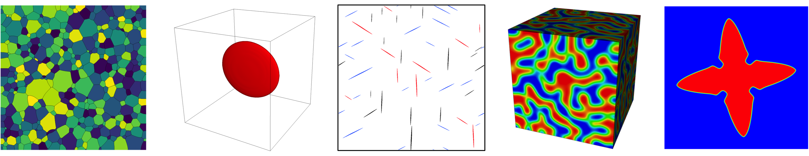

***
## Overview
PRISMS-PF is a powerful, massively parallel finite element code for conducting phase field and other related simulations of microstructural evolution. The phase field method is commonly used for predicting the evolution if microstructures under a wide range of conditions and material systems. PRISMS-PF provides a simple interface for solving customizable systems of partial differential equations of the type commonly found in phase field models, and has 22 pre-built application modules, including for precipitate evolution, grain growth, dendritic solidification, and spinodal decomposition.

### Features and Capabilities
- Matrix-free finite element framework for improved performance over traditional finite element approaches
- Parallelization at the inter-node, intra-node, and intra-core levels (MPI, threads, vectorization), with near ideal scaling beyond 1,000 cores
- Adaptive meshing to greatly reduce problem sizes
- Support for high order elements, with up to 5th order spatial accuracy
- Support for explicit nucleus placement to enable simulations that include nucleating phases
- Grain-remapping algorithm to facilitate simulations of polycrystals with thousands of grains
- Simple interface to solve an arbitrary number of coupled PDEs
- Straightforward Docker-based installation

### Acknowledgements
This code is developed by the PRedictive Integrated Structural Materials Science (PRISMS) Center at University of Michigan which is supported by the U.S. Department of Energy (DOE), Office of Basic Energy Sciences, Division of Materials Sciences and Engineering under Award #DE-SC0008637.

### License
PRISMS-PF is released under the GNU Lesser General Public License (LGPL).

***
## Announcements
- 8/21/2018: The tentative dates for the 2019 PRISMS Workshop are August 5-9 in Ann Arbor, MI. The first three days are dedicated to hands-on training with the PRISMS codes (including a day for PRISMS-PF). The final two days are a series of technical presentations by members of the PRISMS Center and distinguished outside guests. For more information, please send a message to [prismsphasefield.dev@umich.edu](mailto:prismsphasefield.dev@umich.edu).

- 8/21/2018: [Version 2.1 released.](https://github.com/prisms-center/phaseField/releases/tag/v2.1) This is a moderate-level update to v2.0.2. The structure of equations and ICs/BCs files has been updated for improved legibility and flexibility. A new grain-remapper has been introduced to handling polycrystalline simulations with many grains and a new hybrid Newton/Picard nonlinear solver has been added.

- 8/3/2018: The new [online PRISMS-PF user manual](doxygen_files/manual.html) is released. This replaces the PDF user manual previously used.

- 5/30/2018: [Version 2.0.2 released.](https://github.com/prisms-center/phaseField/releases/tag/v2.0.2) This is a minor update to v2.0.1. The biggest change is that nucleation parameters can now be set on a per-variable basis.

- 11/21/2017: [Version 2.0.1 released.](https://github.com/prisms-center/phaseField/releases/tag/v2.0.1) This is a minor update to v2.0. The biggest change is the introduction of a checkpoint/restart system.

***
## General Links
- [PRISMS Center homepage](http://www.prisms-center.org/#/home)  
- [Code repository](https://github.com/prisms-center/phaseField)  
- [User registration link](http://goo.gl/forms/GXo7Im8p2Y)

***
## Getting Started
- [Installation instructions](doxygen_files/install.html)  
- [User manual](doxygen_files/manual.html)  
- [Repository of training slides and exercises](https://goo.gl/BBTkJ8)

***
## Getting Help
- [PRISMS-PF forum](https://groups.google.com/forum/#!forum/prisms-pf-users)  
- [Code documentation](doxygen_files/index.html)  
- [Email the developers](mailto:prismsphasefield.dev@umich.edu)

***
## Publications
[DeWitt, Solomon, Natarajan, Araullo-Peters, Rudraraju, Aagesen, Puchala, Marquis, Van der Ven, Thornton, and Allison, Misfit-driven β′′′ precipitate composition and morphology in Mg-Nd alloys, Acta Materialia, 136 (2017)](https://www.sciencedirect.com/science/article/pii/S1359645417305281)

[DeWitt and Thornton, Phase Field Modeling of Microstructural Evolution in Computational Materials System Design, Shin and Saal, Eds., Springer Nature, London (2018)](https://link.springer.com/chapter/10.1007/978-3-319-68280-8_4)

(Note: If you use PRISMS-PF in one of your publications, please send the publication information to [prismsphasefield.dev@umich.edu](mailto:prismsphasefield.dev@umich.edu) to help us demonstrate our impact to our funding agency.)
