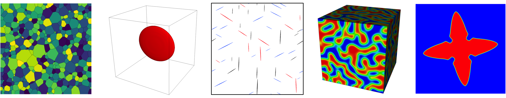

***
## Overview
PRISMS-PF is a powerful, massively parallel finite element code for conducting phase field and other related simulations of microstructural evolution. The phase field method is commonly used for predicting the evolution if microstructures under a wide range of conditions and material systems. PRISMS-PF provides a simple interface for solving customizable systems of partial differential equations of the type commonly found in phase field models, and has 29 pre-built application modules, including for precipitate evolution, grain growth, dendritic solidification, corrosion and spinodal decomposition.

***
### Features and Capabilities

- Matrix-free finite element framework for improved performance over traditional finite element approaches
- Parallelization at the inter-node, intra-node, and intra-core levels (MPI, threads, vectorization), with near ideal scaling beyond 1,000 cores
- Adaptive meshing to greatly reduce problem sizes
- Support for high order elements, with up to 5th order spatial accuracy
- Support for explicit nucleus placement to enable simulations that include nucleating phases
- Grain-remapping algorithm to facilitate simulations of polycrystals with thousands of grains
- Simple interface to solve an arbitrary number of coupled PDEs
- Straightforward Docker-based installation

***
## General Links
- [PRISMS Center homepage](http://www.prisms-center.org/#/home)  
- [PRISMS-PF code repository](https://github.com/prisms-center/phaseField)  
- [YouTube channel](https://www.youtube.com/channel/UCZXc3007JuBCGKDcneD_umA/playlists)
- [Virtual Machine](http://www.prisms-center.org/#/ctools/software) (contains most of the PRISMS Center tools, including PRISMS-PF)

***
## Getting Started
- [Quick start guide](https://github.com/prisms-center/phaseField#quick-start-guide)  
- [Manual](doxygen/index.html)  

***
## Getting Help
- [Discussions](https://github.com/prisms-center/phaseField/discussions)  
- [Manual](doxygen/index.html)  

### Acknowledgements
This code is developed by the PRedictive Integrated Structural Materials Science (PRISMS) Center at University of Michigan which is supported by the U.S. Department of Energy (DOE), Office of Basic Energy Sciences, Division of Materials Sciences and Engineering under Award #DE-SC0008637.

### License
PRISMS-PF is released under the GNU Lesser General Public License (LGPL).

### Citing PRISMS-PF

Please cite [the following reference](https://doi.org/10.1038/s41524-020-0298-5) when discussing PRISMS-PF in a publication:

S. DeWitt, S. Rudraraju, D. Montiel, W.B. Andrews, and K. Thornton. PRISMS-PF: A general framework for phase-field modeling with a matrix-free finite element method. _npj Computational Materials_ __6__, 29 (2020).

If additionally you would like to cite a specific release of PRISMS-PF, please use the following format:

PRISMS-PF, v3.0.0 (2026). Available from https://github.com/prisms-center/phaseField. DOI: 10.5281/zenodo.19261983.

For DOI information for other releases, please refer to [this site](https://zenodo.org/record/3357005).

## Publications That Use PRISMS-PF

Note: If you use PRISMS-PF in one of your publications, please send the publication information to [prismsphasefield.dev@umich.edu](mailto:prisms-pf@umich.edu) to help us demonstrate our impact to our funding agency.

[Wang and Liu, Multiscale thermo-kinetic characterization for β′ and β1 precipitation in Mg-Sm alloys, Acta Mater. 254, 119011 (2023)](https://doi.org/10.1016/j.actamat.2023.119011)

[Pendl and Hochrainer, Coupling stress fields and vacancy diffusion in phase-field models of voids as pure vacancy phase, Comput. Mater. Sci. 224, 112157 (2023)](https://doi.org/10.1016/j.commatsci.2023.112157)

[Goel, Lyu, DeWitt, Montiel, and Thornton, Simulating microgalvanic corrosion in alloys using the PRISMS phase-field framework, MRS Communications 12, 1050–1059 (2022)](https://doi.org/10.1557/s43579-022-00266-6)

[Bhagat and Rudraraju, Modeling of dendritic solidification and numerical analysis of the
phase-field approach to model complex morphologies in alloys, arXiv preprint (2022)](https://doi.org/10.48550/arXiv.2210.14449)

[Kinzer and Chandran, A Phase-Field Study on the Effects of Nanoparticles on Solidification and Grain Growth, arXiv preprint (2022)](https://doi.org/10.48550/arXiv.2207.07153)

[Gao, Wang, Li, et al,, Cerium-alloyed ultra-high strength maraging steel with good ductility: Experiments, first-principles calculations and phase-field simulations, Materials Science and Engineering: A 846, 14330 (2022)](https://doi.org/10.1016/j.msea.2022.143306)

[Yao, Montiel, and Allison, Investigating the Effects of Dendrite Evolution on Microsegregation in Al–Cu Alloys by Coupling Experiments, Micro-modeling, and Phase-Field Simulations. Metall Mater Trans A 53, 3341–3356 (2022)](https://doi.org/10.1007/s11661-022-06748-5)

[Cao, Zhang, Meng, and Zhang, Analyzing effects of temperature gradient and scan rate on metal additive manufacturing microstructure by using phase field-finite element method, Modelling Simul. Mater. Sci. Eng. 30, 034003 (2022)](https://iopscience.iop.org/article/10.1088/1361-651X/ac4f3a)

[Brewick, Simulating Pitting Corrosion in AM 316L Microstructures Through Phase Field Methods and Computational Modeling, J. Electrochem. Soc. 169, 011503 (2022)](https://iopscience.iop.org/article/10.1149/1945-7111/ac4935)

[DeWitt, Rudraraju, Montiel, Andrews and Thornton, PRISMS-PF: A general framework for phase-field modeling with a matrix-free finite element method, npj Comput Mater 6, 29 (2020)](https://www.nature.com/articles/s41524-020-0298-5)

[Aagesen, Adams, Allison, et al., PRISMS: An Integrated, Open-Source Framework for Accelerating Predictive Structural Materials Science,  JOM 70, 2298–2314 (2018)](https://link.springer.com/article/10.1007%2Fs11837-018-3079-6)

[DeWitt, Solomon, Natarajan, Araullo-Peters, Rudraraju, Aagesen, Puchala, Marquis, Van der Ven, Thornton, and Allison, Misfit-driven β′′′ precipitate composition and morphology in Mg-Nd alloys, Acta Materialia, 136, 378-389 (2017)](https://www.sciencedirect.com/science/article/pii/S1359645417305281)

## Publications That Cite PRISMS-PF

[Gao, Peng, Zhang, et al., Profound strengthening and toughening effect of reinforcement aspect ratio in composite with network architecture, Journal of Alloys and Compounds, 167444 (2022)](https://doi.org/10.1016/j.jallcom.2022.167444)

[Endo, Matsuda, Tanaka, et al., A phase-field model by an Ising machine and its application to the phase-separation structure of a diblock polymer, Sci Rep 12, 10794 (2022)](https://doi.org/10.1038/s41598-022-14735-4)

[Stewart, Recent progress on the mesoscale modeling of architected thin-films via phase-field formulations of physical vapor deposition, Computational Materials Science 211, 111503 (2022)](https://doi.org/10.1016/j.commatsci.2022.111503)

[Hong and Viswanathan, Open-Sourcing Phase-Field Simulations for Accelerating Energy Materials Design and Optimization, ACS Energy Letters 2020 5, 3254-3259 (10)](https://pubs.acs.org/doi/abs/10.1021/acsenergylett.0c01904)

[DeWitt and Thornton, Phase Field Modeling of Microstructural Evolution in Computational Materials System Design, Shin and Saal, Eds., Springer Nature, London (2018)](https://link.springer.com/chapter/10.1007/978-3-319-68280-8_4)

[Yaghoobi, Ganesan, Sundar, Lakshmanan, Rudraraju, Allison, and Sundararaghavan, PRISMS-Plasticity: An open-source crystal plasticity finite element software, Computational Materials Science 169, 109078 (2019)](https://www.sciencedirect.com/science/article/abs/pii/S0927025619303696)

[Wheeler, Keller, DeWitt, Jokisaari, Schwen, Guyer, Aagesen, Heinonen, Tonks, Voorhees, and Warren, 2019. PFHub: The Phase-Field Community Hub. Journal of Open Research Software, 7(1), 29 (2019)](https://openresearchsoftware.metajnl.com/article/10.5334/jors.276/)

[Hötzer, Reiter, Hierl, Steinmetz, Selzer, and Nestler, The parallel multi-physics phase-field framework Pace3D, Journal of Computational Science 26, 1-12 (2018)](https://www.sciencedirect.com/science/article/abs/pii/S1877750317310116)

[Tonks and Aagesen, The Phase Field Method: Mesoscale Simulation Aiding Material DiscoveryAnnual Review of Materials Research 49, 79–102 (2019)](https://www.annualreviews.org/doi/abs/10.1146/annurev-matsci-070218-010151)
